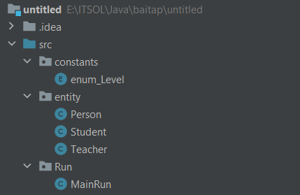

# `Encapsulation` - Tính đóng gói trong OOP
# `1. Đóng gói ở mức class `
- `Access modifier` ==> Quy định quyền truy cập vào thuộc tính, phương thức, class.
- Các loại `access modifier`:
    - `public`: truy cập ở cả trong và ngoài class, trong và ngoài package thông qua object. 
        ```java
        public int id;
        ```
    - `protected`: truy cập ở trong và ngoài class, nhưng trong cùng package và các class kế thừa nó.
        ```java
        protected String name;
        ```
    - `private`: chỉ truy cập trong cùng 1 class
        ```java
        private String gender;
        ```
    - `default`: truy cập trong và ngoài class nhưng trong cùng 1 package
        ```java
        float gpa;
        ```

    ==> Đặt trước thuộc tính, phương thức

    ==> Mục đích sử dụng access modifiers: để phân hóa, chuyên biệt hóa rõ ràng nhiệm vụ và quyền hạn (phạm vi hoạt động) của từng thuộc tính, phương thức trong project.

   *Lưu ý*: 
   - Class chỉ có 2 phạm vi truy cập là `public` và `default`. 
   - Trong 1 file `.java` có nhiều class được tạo ra, khi biên dịch file `.java` đó có bao nhiêu class thì có bấy nhiêu file .class tương ứng.

# `2. Đóng gói ở mức package`
- Là việc chia nhỏ project (phân loại các class có trong project) vào các package riêng biệt, mỗi package thể hiện một đặc tính hoặc chức năng cụ thể và phân tách với các package khác. 

<p align="center">

</p>

## Cách truy cập vào thuộc tính private của 1 class mà không phá vỡ tính đóng gói của class đó
Không thể truy cập trực tiếp đến các thuộc tính private của đối tượng mà phải thông qua `getter & setter`
- Sử dụng phương thức getter & setter
    - Phương thức `get`: trả về giá trị thuộc tính nào đó
    ```java
    public String getName() {
        return this.name;
    }
    ```
    - Phương thức `set`: gán hoặc thay đổi giá trị cho thuộc tính
    ```java
    public void setName(String name) {
        this.name = name;
    }
    ```


# Constructor - hàm khởi tạo
- Trong java có thể tạo nhiều hàm khởi tạo: khởi tạo không tham số, hoặc khởi tạo có tham số.
- Quy tắc tạo Constructor:
    - Đặt tên giống với tên của class
    - Không có kiểu trả về
    ```java
        // Hàm khởi tạo không tham số
        public BanDoc() {

        }
        //Hàm khởi tạo có tham số
        public BanDoc(int id, String name, String address) {
            this.id = id;
            this.name = name;
            this.address = address;
        }
    ```
    - Constructor không tham số còn được gọi là hàm khởi tạo mặc định. Nếu như không khởi tạo bất kỳ một constructor nào thì trình biên dịch sẽ tự tạo ra 1 constructor mặc định. 

- `Overloading (Nạp chồng phương thức)`: trong cùng 1 class có nhiều hàm có cùng tên với nhau, nhưng khác nhau về tham số truyền vào: kiểu dữ liệu tham số, số lượng tham số truyền vào.

```java
    public static int tinhTong(int a, int b) {
        return a + b;
    }

    public static float tinhTong(float c, float d) {
        return c + d;
    }

    public static int tinhTong(int a, int b, int i, int j) {
        return a + b + i + j;
    }
```
- Constructor Overloading: tạo ra nhiều hàm khởi tạo trong cùng 1 class nhưng khác nhau về danh sách tham số truyền vào:
```java
        public BanDoc(int id) {
            this.id = id;
        }

        public BanDoc(int id, String name, String address) {
            this.id = id;
            this.name = name;
            this.address = address;
        }

        public BanDoc(String name, int gpa) {
            this.name = name;
            this.gpa = gpa;
        }
    ```