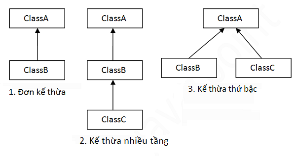

# `Inheritance` - Tính kế thừa trong java OOP
## `1. Kế thừa class`
- Một lớp con kế thừa lớp cha là nó sẽ kế thừa tất cả những thuộc tính và phương thức mà lớp cha có.
- Từ khóa `extends` được dùng để thể hiện sự kế thừa của lớp con với lớp cha. 
```java
    public class Student extends Person {

    }
```
- **Mục đích của kế thừa**:
    -   Đưa các thuộc tính chung của lớp con vào trong lớp cha để **tránh việc lặp code**, tuân theo nguyên tắc DRY (Don't Repeat Yourself - Đừng bao giờ lặp lại code)

        ==>**tăng tính tái sử dụng**
- Trong java, `một class không thể kế thừa từ nhiều lớp cha khác nhau` dạng `public class A extends B, C {}`. 

    Nhưng trong java có hỗ trợ các loại kế thừa sau:

    - ` Đơn kế thừa`: class B extends class A.
    - `Kế thừa đa cấp bậc`: class C extends class B, class B extends class A; lúc này có thể hiểu là class A cũng kế thừa class C
    - `Kế thừa thứ bậc`: Class B extends class A, class C extends class A

    <p align = "center">
    
    </p>
- Khi khởi tạo và gọi 1 phương thức nào đó, nó sẽ ưu tiên tìm và gọi đến phương thức có trong lớp con trước, trường hợp lớp con không có nó mới gọi đến phương thức ở lớp cha, lớp ông...
# `2. Kế thừa Interface`

### Interface là một dạng của class nhưng nó không giống class thông thường.
```java
    public interface DiChuyen {

    }
```

- Interface `không thể khai báo thuộc tính`
- `Chỉ có thể khai báo phương thức (method)`, nhưng phương thức `không có thân`.
    ```java
        // lỗi
        public void nhapThongTin() {
            System.out.print("-----------");
        }

        // đúng
        public void inThongTin();
    ```
- Tất cả các thành phần (phương thức) trong `interface` đều được để `access modifier` mặc định là `public` (có thể viết thêm public vào cũng thành thừa, không có ý nghĩa)

    ```java
        void inThongTin; <==> public void inThongTin();
    ```
- `Chỉ được phép khai báo hằng số`, không phải biến số hay thuộc tính. Hằng số trong `interface` thì mặc định là public static final (có viết thêm vào cũng thành thừa).
    ```java
        double gpa = 8.0; <==> public static final double gpa = 8.0;
    ```
- `Interface` không thể khởi tạo được đối tượng

### * Mục đích của Interface là gì? Nó có khác biệt gì so với class về mặt ý nghĩa???

- `Interface` sinh ra để định nghĩa ra các khả năng có thể thực hiện được của 1 đối tượng

    ==> định nghĩa ra các khả năng Tổng quát của 1 tập hợp các đối tượng có thể không cùng thuộc tính nhưng `cùng khả năng` (chỉ khác về cách thực hiện khả năng)

    Ví dụ: Có 2 đối tượng ConMeo và ConNguoi, 2 đối tượng này có cùng khả năng là di chuyển, nhưng khác nhau về cách di chuyển. Với đối tượng ConMeo, nó di chuyển bằng chạy nhảy 4 chân. Còn với ConNguoi, có thể đi chạy nhảy bằng 2 chân, hoặc di chuyển bằng các phương tiện giao thông. ==> Lúc này khả năng di chuyển sẽ được khai báo với dạng Interface.

### Từ khóa `Implements`
```java
    public class ConMeo implements DiChuyen {

    }
```
- Từ khóa `implements` thể hiện rằng lớp ConMeo kế thừa interface DiChuyen.
- `ConMeo` sẽ có những phương thức mà `interface` `DiChuyen` đang có.

==> **Class** nào kế thừa interface thì bắt buộc phải viết thân cho các phương thức mà interface đã định nghĩa, sử dụng Override ().

Lưu ý: Java không hỗ trợ đa kế thừa với class. một class chỉ có thể kế thừa 1 Class, nhưng có thể kế thừa nhiều Interface

## `3. Override - ghi đè`
- Là khi Class(Interface) cha có hàm(phương thức) X rồi và class con kế thừa class(interface) đó sẽ phải viết lại hàm X.

==> `@Override` ở phía đầu hàm để đánh dấu đây là hàm viết lại của class cha đã có.
- `Chỉ Override phương thức, không có thuộc tính.`
```java
    public interface DiChuyen {
        void diChuyen();
    }

    public class ConMeo implements DiChuyen {
        @Override
        public void diChuyen() {
            // khả năng di chuyển
        }
    }
```

** Khi khởi tạo đối tượng của 1 lớp con, thì nó mặc định sẽ gọi đến hàm khởi tạo constructor của lớp cha trước, sau đó gọi đến constructor của lớp con.
```java
class Person {
    public Person() {
		System.out.println("Person constructor");
	}
}

class Student extends Person {
	public Student() {
		System.out.println("Student constructor");
	}
}

class Entry {
	public static void main(String[] args) {
		Student s = new Student();
	}
}

    // Kết quả:
    // Person constructor
    // Student constructor
```
## `4. Từ khóa super`
- `super` là 1 từ khóa được sử dụng trong phạm vi của 1 hàm. Nó có tác dụng truy cập tới các thành phần (thuộc tính, phương thức) của lớp cha, ông, cụ...
- Từ khóa `super` khác từ khóa `this` ở chỗ từ khóa `super sẽ tham chiếu tới lớp cha` còn từ khóa `this sẽ tham chiếu tới lớp hiện tại`
### Sự ảnh hưởng của access modifier trong kế thừa
- Một lớp con muốn truy cập đến các thuộc tính của lớp cha phải sử dụng getter & setter.
```java
    public class ConNguoi {
        private int id;
        private String name;

        public ConNguoi() {

        }

        public int getId() {
            return id;
        }

        public void setId(int id) {
            this.id = id;
        }

        public String getName() {
            return name;
        }
        
        public void setName(String name) {
            this.name = name;
        }

        public void hienThi() {
            System.out.println("Id: " + this.id);
            System.out.println("Name: " + this.name);
        }
    }
```
```java
    public class SinhVien extends ConNguoi {
        private String level;

        public SinhVien() {

        }

        public String getLevel() {
            return level;
        }

        public void setLevel(String level) {
            this.level = level;
        }

        public void nhapThongTin() {
            super.setId(5);
            super.setName("Nguyen A");
            level.setLevel("Sinh viên");
        }

        @Override
        public void hienThi() {
            super.hienThi();
            System.out.println("Level: " + this.level);
        }

    }
```
## Tech as product test one preset
