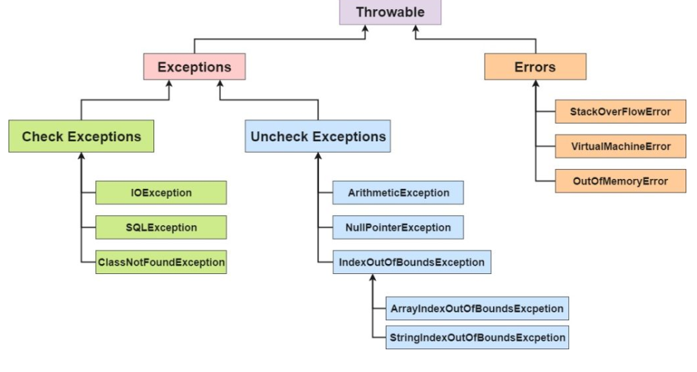

# Exception - Ngoại lệ
- `Mục đích`: Được sử dụng để xử lý những phát sinh có thể xảy ra trong khi thực thi code chương trình.
- `Hệ thống phân cấp của lớp Ngoại lệ trong java`: 

    Lớp java.lang.Throwable là lớp gốc của hệ thống phân cấp ngoại lệ Java và được kế thừa bởi hai lớp con: Exception và Erro

<p align = center>

</p>

## `Các loại ngoại lệ của Java`
Chủ yếu có hai loại ngoại lệ: checked và unchecked. Tuy nhiên, theo Oracle, có ba loại ngoại lệ:
- Checked exception
- UnChecked exception
- Errors

<p align = "center">

</p>

`Phân biệt các loại ngoại lệ java: `

`1) Checked exception`

- Các lớp kế thừa trực tiếp lớp Throwable ngoại trừ RuntimeException và Error được gọi là các ngoại lệ đã kiểm tra. Ví dụ, IOException, SQLException, v.v. La các ngoại lệ được kiểm tra tại thời điểm biên dịch.

`2) Unchecked exception`
- Các lớp kế thừa RuntimeException được gọi là các ngoại lệ không được kiểm tra. Ví dụ, ArithmeticException, NullPointerException, ArrayIndexOutOfBoundsException, v.v. Đây là các ngoại lệ không được kiểm tra tại thời điểm biên dịch, nhưng chúng được kiểm tra trong thời gian chạy.

`3) Error`
- Lỗi không thể khôi phục được. Một số ví dụ về lỗi là OutOfMemoryError, VirtualMachineError, AssertionError, v.v. Cũng là 1 dạng unchecked

## `Từ khóa ngoại lệ java`

```java
    try{ // khối try bao bọc đoạn code có thể xảy ra lỗi

    } catch(ExceptionType name){ // khối catch để xử lý ngoại lệ

    } finally{ // đoạn code luôn được thực thi

    }
```
 - Trong đoạn `try` có thể xảy ra nhiều lỗi khác nhau, nên có thể sử dụng nhiều `catch` khác nhau để bắt được các lỗi đấy
 - Khi có nhiều hàm `catch` như thế, khi trong `try` bắt gặp 1 lỗi nào đó thì nó sẽ ưu tiên kiểm tra `catch` được viết từ trên xuống dưới. 
 - Lưu ý nguyên tắc khi viết nhiều `catch`, `catch` bên trên là những `catch` `xử lý cụ thể`, càng xuống dưới là những `catch` xử lý `tổng quát` hơn.
    ```java
        try{
            ....
        } catch(ArithmeticException e){
            // lỗi về tính toán
        } catch(InputMismatchException ex){
            // lỗi về nhập
        } catch(Exception exception){
            // lỗi tổng quát
        }
    ```
- Khi các `catch` có cùng cách xử lý lỗi thì có thể kết hợp vào chung 1 `catch`, và trường hợp các `catch` đó `ngang hàng`, vd cách viết như sau:
```java
    try{
        .....
    } catch( InputMismatchException | ArithmeticException e){
        // xử lý lỗi
    }
```
## `try ... catch ... finally`
- `finally` viết ở **sau** `catch` **cuối cùng**
- Đoạn code trong `finally` luôn được thực thi dù có xảy ra ngoại lệ hay không.
- `finally` có thể `có hoặc không` trong `try - catch`, tùy thuộc vào bài toán.
- Mục đích: được sử dụng trong 1 số bài toán như đóng file, đóng kết nối tới một cái gì đó...

`Lưu ý`:  **Có `try` thì phải có `catch` hoặc `finally`, không bao giờ chỉ có try không**

## `Từ khóa throw và throws`
### Từ khóa `throw`
Từ khoá `throw` trong java được sử dụng để `ném` ra một ngoại lệ (exception) cụ thể.

Cú pháp: `throw new exception_type("message")`
```java
    private static void tinhThuong{
        try{
            int a = new Scanner(System.in.nextInt());
            int b = new Scanner(System.in.nextInt());
            if (b == 0){
                throw new Exception("Không thể thực hiện phép chia cho 0");
            }
            System.out.println("Kết quả của phép tính " + a + "/" + b + "là: " + a/b);
        } catch(Exception e){
            e.printStackTrace();
        }
    }
```
### Từ khóa `throws`
Từ khóa `throws` trong java được sử dụng để `khai báo một ngoại lệ`, nó ủy thác cho những ai gọi đến nó phải xử lý
Cú pháp:
```java
return-type method-name() throws exception-type{

}
```
vd:
```java
    public static void main(String[] args){
        try{
            tinhThuong();
        } catch (Exception e){
            System.out.println("Không thể chia 1 số cho 0");
        }
    }
    public static void tinhThuong() throws Exception{
        int a = new Scanner(System.in.nextInt());
        int b = new Scanner(System.in.nextInt());
        System.out.println("Kết quả của phép tính " + a + "/" + b + "là: " + a/b);
    }
```
